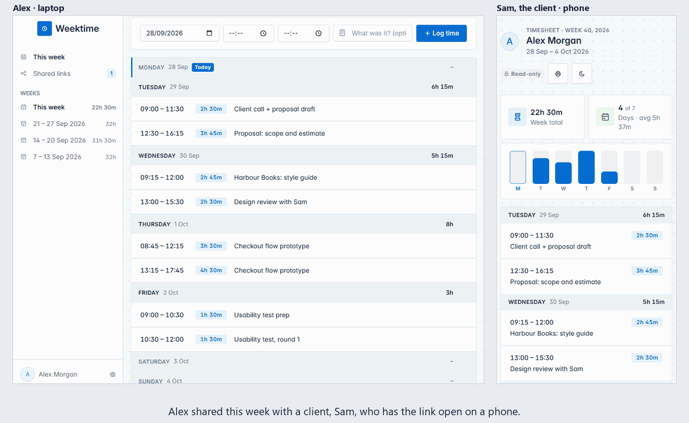
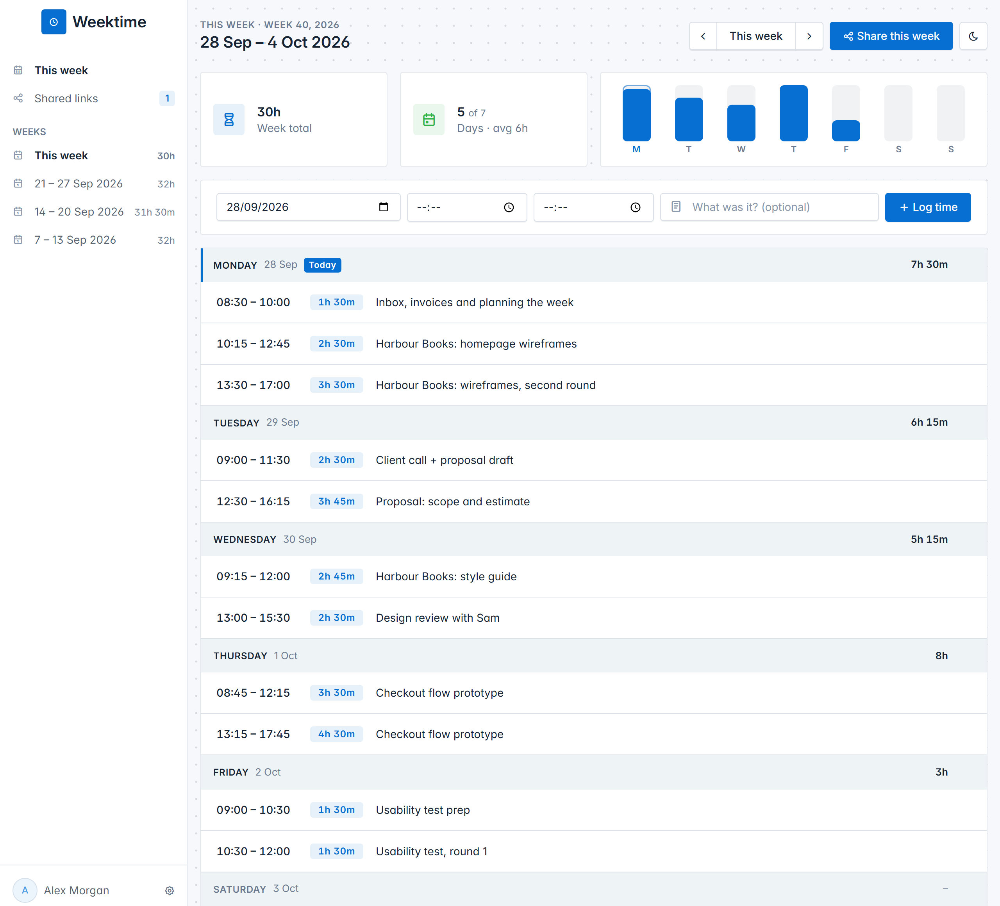
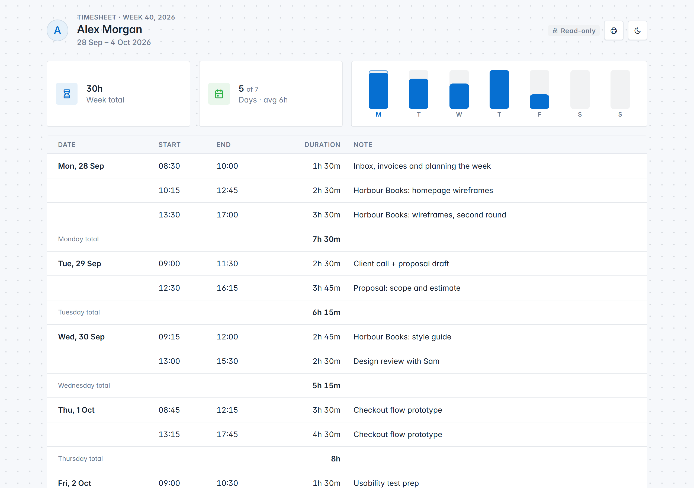
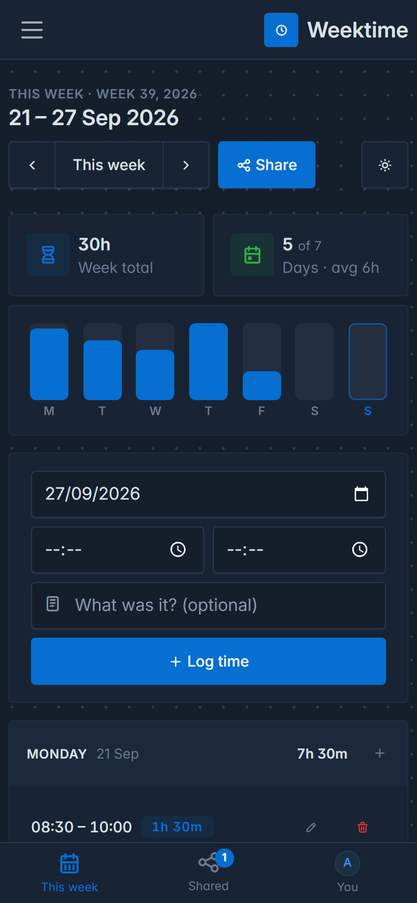

# Weektime

[](https://github.com/ReDCLiF-Unknow/weektime/actions/workflows/ci.yml)
[](LICENSE)

A weekly timesheet you can share with a link: Go, SQLite, `html/template`, and the [Tabler](https://tabler.io)
UI + Tabler Icons. Includes a CLI (Cobra + Resty) that talks to the server's JSON API.

There is no sign-up form, no password and no email. You type your name and get a **private link**, and that
link is your timesheet. Log what you worked on, day by day; Weektime adds it up. When a manager, client or
accountant needs to see a week, press **Share this week** and send them a read-only link. You can turn that
link off whenever you like.

One binary serves everything, including its own CSS, JavaScript and fonts, so a page load reaches nothing
but your own server: no CDN learns who is using it, and it works on a network with no way out.

The shared week is live. Alex logs time on a laptop, and the client Alex sent the link to sees each entry
and the totals arrive on their phone at once; when Alex turns the link off, it stops working that moment:



<picture>
  <source media="(prefers-color-scheme: dark)" srcset="docs/week-dark.png">
  
</picture>

<table>
<tr>
<td width="68%"></td>
<td width="32%"></td>
</tr>
<tr>
<td><em>What someone you share a week with sees</em></td>
<td><em>On a phone</em></td>
</tr>
</table>

## Install

**Docker**: the image carries both binaries and nothing else is needed:

```
docker run -d --name weektime -p 8080:8080 -v weektime:/data ghcr.io/redclif-unknow/weektime:latest
```

Or with the [compose file](compose.yaml): `docker compose up -d`. The database lives in the `/data`
volume, so it survives upgrades. Images are built for amd64 and arm64, so a Raspberry Pi works too.

`:latest` is the newest release; pin a version instead (`:v1.0.0`) if you'd rather upgrade
deliberately. `:main` is built from the development branch and is not promised to work.

**A prebuilt binary**: download the archive for your system from the
[latest release](https://github.com/ReDCLiF-Unknow/weektime/releases/latest), unpack it, and run
`weektime-server`. There is nothing to install alongside it: the database is a SQLite file created
on first run.

Either way, open <http://localhost:8080> and type your name.

## Keep the database

**Every timesheet is in one SQLite file, and nothing else anywhere knows about them.** If a server
starts without that file, it makes a new, empty one: every timesheet is gone, and every private link
made before then says it is invalid. There is no password or email to get them back through.

So put the database somewhere that outlasts a restart, an upgrade and a redeploy:

- **Docker**: give `/data` a volume, as the command above does with `-v weektime:/data`. Without one,
  Docker gives each new container a fresh anonymous volume, so replacing the container to upgrade
  quietly starts from nothing. The compose file sets one up.
- **A hosting platform** (Coolify, Railway, Fly.io, Render and the like): add its persistent storage
  and mount it at `/data`. Many of them throw the container's disk away on every deploy.
- **The binary**: `weektime.db` is created in the folder you run it from. Unpacking a new release into
  a new folder and running it there starts a new, empty database; pass the old one with
  `-db C:\path\to\weektime.db`, or run it from the same folder.

The server says what it found every time it starts. A database it already had:

```
database: /data/weektime.db, 12 timesheets
```

and one it had to create, which is only right the very first time:

```
database: created a new, empty one at /data/weektime.db

    If this is not the first time this server has started, its timesheets
    are not where it is looking, ...
```

To back it up, copy it with `sqlite3 weektime.db ".backup out.db"` while the server runs, or copy the
file while it is stopped.

## Run from source

```
go run ./cmd/server            # http://localhost:8080, database in ./weektime.db
go run ./cmd/server -addr localhost:9000 -db /path/to/weektime.db
```

SQLite is provided by the pure-Go `modernc.org/sqlite`, so no C compiler is needed. It runs in
write-ahead logging mode; back the database up with `sqlite3 weektime.db ".backup out.db"` or while
the server is stopped, rather than copying the file from under it.

The stylesheets, scripts and fonts live in `internal/web/static/vendor/` and are compiled into the
binary, so building needs nothing but Go. To change a version, edit the numbers at the top of
[tools/vendor/fetch.py](tools/vendor/fetch.py) and run it; it re-downloads them and cuts the icon font
down to the icons the templates actually use (5KB rather than 844KB).

## Logging time

- **A week at a time.** The main screen is the current week, Monday to Sunday (ISO weeks, so week 1 is
  the one with the year's first Thursday). The arrows go to the week before and after; the sidebar lists
  your latest weeks with how much each one has.
- **Five fields.** Each entry is a date, a start, an end and a short note. The duration is worked out from
  the times, never typed, and the button says it before you press it ("Log 2h 30m"). The date starts on
  today. A day can have as many entries as you like.
- **Quick to repeat.** After you log an entry, the next one starts where it ended, on the same day, so a day
  of work is a few end times in a row. The **+** on a day's heading logs time on that day.
- **Totals everywhere.** Each day's total is on its heading, the week's is at the top and the bottom, with
  how many days you worked, the average per day worked, and a bar for each day.
- **Edit anything.** The pencil on an entry changes it in place (Esc cancels). Moving it to a day in another
  week takes you to that week.
- **Undo delete.** Deleting an entry shows an "Entry deleted · Undo" toast. It can be brought back for a
  day, after which it is purged.
- **Live.** Nothing reloads the page, and a change made in another tab, on another device or with the CLI
  appears within a moment, via server-sent events (`/events`). Anything you are in the middle of editing
  waits until you are done.

An entry stays inside one day and has to end after it starts; work past midnight is two entries.

## Your private link

There are no passwords. When you type your name, the server makes a secret token and sends you to your
private link, `/u/<token>`, which asks you to **bookmark it**: the page's address is the link. Only a
hash of the token is stored, so it cannot be read back out of the database.

- Opening the link signs that browser in (it is kept in an `HttpOnly` cookie from then on), so it is also
  how you carry on on your phone or another computer. Pasting it into "Already have a private link?" does
  the same.
- Until you say you have it somewhere safe, every page reminds you, because losing it means losing the
  timesheet: there is no password to reset and no email to send. Copying it from **Your profile** counts.
- Opening somebody else's link in a browser that is signed in already asks before switching, and says
  so plainly if the timesheet signed in now has never had its link saved. A link is something any
  website can send your browser to, so it must not be able to sign you out of your own timesheet.
- Every page is sent with `Referrer-Policy: no-referrer`, so the link in your address bar is never passed
  on to a site you follow a link to.

Anyone who has your private link can read and change your hours, so treat it like a password. To show
somebody your hours, share a week instead.

## Sharing a week

**Share this week** makes a read-only link, `/s/<code>`, for that one week. Whoever opens it sees your
name, the week, every entry with its start, end, duration and note, each day's total and the week's,
and nothing else: not your other weeks, and no way to change anything. They need no account, and opening
it does not sign them in as anybody.

- The page keeps itself up to date: log more time and it appears on their screen too.
- It prints cleanly, for an accountant who wants paper.
- Asking to share the same week again gives the same link, so there are never several in circulation.
- **Shared links** in the sidebar lists every link you have out, with its week and total. **Revoke** turns
  one off for good; anyone looking at it is told so at once. Sharing the week again makes a new link.

If you expose the server beyond your own network, put it behind HTTPS so links and cookies are protected.
If you put it behind a reverse proxy, don't let the proxy buffer `/events` or `/s/*/events` (the server
sends `X-Accel-Buffering: no` for nginx).

## On your phone

The layout adapts to the screen: on phones and tablets the sidebar becomes a hamburger menu and a **bottom
tab bar** (This week, Shared, and your profile) appears; touch targets are at least 44px; inputs are 16px
so iPhones don't zoom in when you tap them. Date and time fields are the phone's own pickers.

It is also **installable**: in Chrome/Edge choose *Install*, on iOS Safari *Share → Add to Home Screen*.
There is no service worker, so it needs a connection to your server. Installing from a non-`localhost`
address needs HTTPS.

## CLI

```
go build -o weektime ./cmd/weektime

weektime register "Alex"          # start a timesheet; prints your private link
export WEEKTIME_TOKEN=<link>      # PowerShell: $env:WEEKTIME_TOKEN = "<link>"

weektime log 09:00 11:30 Client call and proposal draft   # today
weektime log 13:00 17:00 Workshop --date 2026-10-14
weektime week                     # this week: entries, each day's total, the week's
weektime week 2026-W42
weektime edit 3 --end 12:15       # only the flags you give are changed
weektime rm 3                     # delete an entry
weektime restore 3                # undo that, within a day

weektime share                    # a read-only link to this week
weektime share 2026-W42
weektime shares                   # every link you have out
weektime revoke 1                 # turn one off
weektime whoami
```

`-t` / `WEEKTIME_TOKEN` takes your private link, or just the token at the end of it. A whole link says which
server it belongs to, so with one there is no need for `-s http://host:port` / `WEEKTIME_SERVER` (default
`http://localhost:8080`). If you already have a link from the browser, use that rather than registering.

## JSON API

Send `Authorization: Bearer <token>` to act as a person; without one, everything is `401`. Entries that
are not yours are `404`. Dates are `YYYY-MM-DD`, times `HH:MM`, weeks `2026-W39` or `current`.

| Method | Path | Body |
|---|---|---|
| POST | `/api/users` | `{"name": "..."}` → `{id, name, token, link}` |
| GET | `/api/me` | |
| GET | `/api/weeks/{week}` | → `{week, name, days: [{date, entries, minutes}], minutes}`, all seven days |
| POST | `/api/entries` | `{"date": "...", "start": "09:00", "end": "11:30", "note": "..."}`; no date means today |
| PATCH | `/api/entries/{id}` | any of `date`, `start`, `end`, `note` |
| DELETE | `/api/entries/{id}` | moves the entry to the trash for a day |
| POST | `/api/entries/{id}/restore` | within a day of deleting it |
| GET | `/api/shares` | the links you have out, each with its `url` |
| POST | `/api/weeks/{week}/share` | → `{id, week, token, url}`; the same link if there is one already |
| DELETE | `/api/shares/{id}` | revokes it |

## Tests

```
go test ./...
```

Every push and pull request runs the same tests on GitHub, along with `gofmt`, `go vet`, a
cross-compile of each released platform, and a build of the Docker image. The CLI is tested the
way it is used: each command runs against a real server and its output is read back. CI also
starts the built container, uses it, and stops it, so the image is known to work rather than
merely to compile.

The screenshots above are generated rather than taken by hand, so they can be redone whenever
the UI changes:

```
python tools/screenshots/shoot.py
```

It starts a server on a spare port, fills it with a week of work, photographs it with headless
Chrome and writes the PNGs into `docs/`, cleaning up after itself. It needs Go, Chrome and
`python -m pip install websockets`.

The animation at the top is `python tools/screenshots/livegif.py`, which also needs
`python -m pip install pillow`. It drives two Chromes, one for Alex and one for the client, who is
signed in as nobody, and writes `docs/live.gif`. It is a storyboard, not a screen recording: each
frame is taken once the page shows what it is meant to, so the result is the same on any machine.
What reaches the client's screen still gets there through the app's own live updates.

## Not yet

Kept out of the first version on purpose, as the concept did: timers, projects or tags,
invoicing, teams, and exports. Three questions are still open before any of those:

- **Who pays**: the person tracking, or the person they share with? Freelancers sharing with
  clients behave very differently from employees reporting to a manager. CSV or PDF export is the
  first thing to add once someone looking at a shared week asks for it.
- **Should a shared week lock?** If this feeds billing, the owner may want to "submit" a week so it
  cannot change after it was sent. Today a shared week shows whatever is logged now.
- **Recovery**: an optional email, so that losing the private link does not mean losing the
  timesheet.

## Licence

[MIT](LICENSE): use it, change it, share it, sell it; just keep the copyright notice.

It stands on other people's open source work: [Tabler](https://tabler.io) and
[Resty](https://github.com/go-resty/resty) (MIT), [Cobra](https://github.com/spf13/cobra) (Apache 2.0),
and [modernc.org/sqlite](https://gitlab.com/cznic/sqlite) (BSD-3-Clause). Tabler's CSS and icons and
the [Inter](https://rsms.me/inter/) typeface (SIL Open Font License 1.1) are redistributed inside the
binary; their licences sit beside them in
[internal/web/static/vendor](internal/web/static/vendor).
